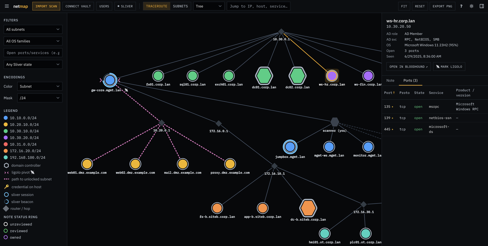
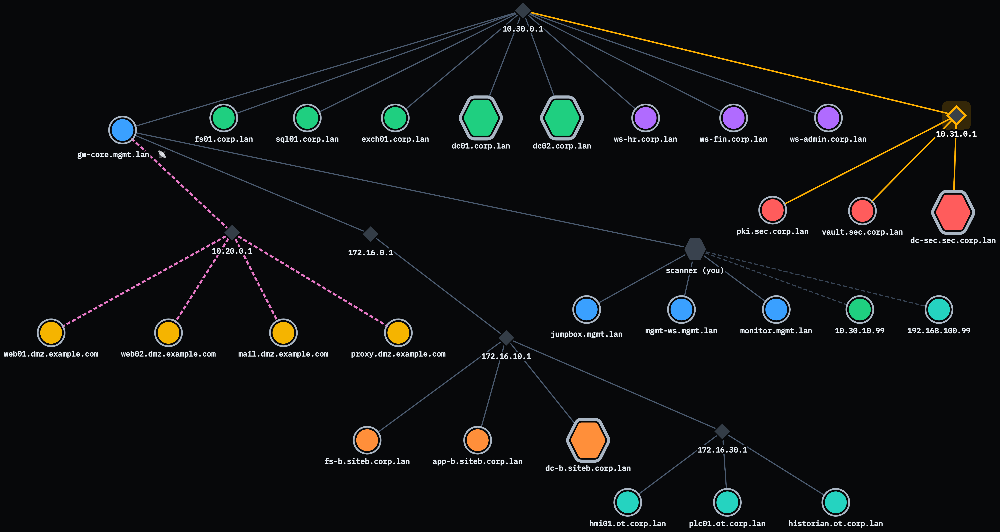
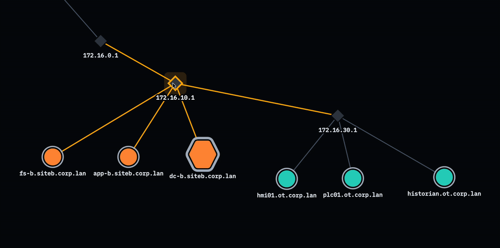

# netmap

[**▶ Live demo**](https://devinkcyber.github.io/netmap/) — runs entirely in your browser on a bundled sample scan; no install, no backend.

[](https://github.com/devinkcyber/netmap/actions/workflows/ci.yml)

**Turn an nmap scan into an interactive network map, with your Obsidian notes attached to every host.**

Import an `nmap -oX` XML scan and netmap renders your network as an interactive
graph. Click any host to read and edit its Obsidian note in place — the note is
the real `.md` file in your vault, read and written through the browser's File
System Access API. No backend, no database, no Obsidian plugin; everything runs
client-side and offline.

Built for pentesters and red-teamers who live in nmap + Obsidian and want their
recon to be visual and their notes one click away.



## Quick start

```bash
git clone https://github.com/devinkcyber/netmap.git
cd netmap
npm install
npm run dev          # → http://localhost:5173
```

Then click **Load sample scan** in the import dialog — no nmap required — to see
the whole thing working against the bundled demo network. To use your own data,
import a real scan (below) and connect your Obsidian vault.

> **Vault editing on Chromium is zero-setup.** The graph works in any modern browser,
> but reading and writing vault notes normally uses the File System Access API
> (`showDirectoryPicker`), which only Chromium ships (Chrome, Edge, Brave, Arc). On
> **Firefox / Safari**, run the tiny local `bridge-vault/` helper and connect through
> it instead — everything else is identical. See [`bridge-vault/README.md`](bridge-vault/README.md).

## Generating a scan

```bash
sudo nmap -sV -O --traceroute -oX scan.xml <targets>
```

| flag | what it gives netmap | required? |
| --- | --- | --- |
| `-oX scan.xml` | the XML netmap parses | **yes** |
| `--traceroute` | real hop paths → genuine topology edges | recommended |
| `-O` | OS detection (drives host colors), needs root | optional |
| `-sV` | service/version detail in the ports table | optional |

Everything optional degrades gracefully: no traceroute falls back to subnet
grouping; without `-O`/`-sV`, hosts are colored "Unknown" and the ports table
shows fewer columns.

## Features



<sub>Hosts colored by subnet · gold-ringed hexagons are domain controllers · the dashed magenta path is a Ligolo pivot unlocking the `10.31.0.0/24` secure enclave · ringed nodes carry live Sliver sessions/beacons.</sub>

- **Interactive topology** — force / concentric / tree layouts, fit, reset,
  arrow-key navigation, shift-drag to move a whole subnet, search (`/`), PNG
  export, and dark & light themes.
- **Two topology models** — *traceroute* chains real hop paths into a tree (with
  router nodes for unscanned hops); *subnets* groups hosts under synthetic subnet
  nodes at a configurable mask.
- **Obsidian notes in place** — click a host to read and edit its real vault
  `.md`; autosave, byte-for-byte frontmatter/`[[wikilink]]` preservation,
  paste-to-embed images, and note scaffolding (see [Integrations](#integrations)).
- **Active Directory awareness** — domain-controller detection from AD service
  fingerprints (gold-ringed hexagons), AD role + exposed AD services per host,
  and domain-based coloring that separates a child domain from its parent.
  Heuristics live in [`src/lib/ad.ts`](src/lib/ad.ts).
- **Recon workflow** — per-host review status (unreviewed / reviewed / owned)
  shown as node rings and filterable; rich filters (subnet, OS family,
  port/service, note status); a live color-by legend.
- **Credentials** — build an AD credential list, tie each entry to a target host,
  and see matches marked with a 🔑 on the graph; the list is encrypted at rest
  behind a passphrase (see [Users & credentials](#users--credentials)).
- **BloodHound CE deep-links** — jump from a host to its node in BloodHound by
  object ID (SID), with a name-based Cypher fallback.
- **Manual overrides & persistence** — right-click a host to flag a Ligolo pivot
  (📡) or force domain-controller status; node positions, the last scan, the vault
  handle, and all settings survive reloads.

## Integrations

netmap is glue between the tools you already run during an engagement — your
Obsidian vault, a BloodHound CE instance, and (optionally) a live Sliver C2. Every
integration is client-side and opt-in, and none of them phone home.

### Obsidian — your vault, edited in place

<!-- GIF: add docs/obsidian.gif, then uncomment the line below -->
<!--  -->

Click a host and its **real** vault note opens in the side panel. This isn't a
copy or an import: netmap reads and writes the actual `.md` file on disk — through
the browser's File System Access API on Chromium, or the `bridge-vault/` helper on
Firefox/Safari — so anything you change is instantly in Obsidian, and edits you
make in Obsidian show up here on the next index. Notes bind to hosts by
frontmatter `ip:`/`host:`, falling back to a filename that is itself the IP.

- **Editor + preview** — a raw-markdown textarea beside a rendered preview
  (`marked` + DOMPurify); `e` toggles them, and edits autosave (debounced) or on
  `Ctrl`/`Cmd+S`.
- **Non-destructive writes** — when netmap updates a field (e.g. review `status:`),
  it rewrites only that one frontmatter line. The rest of the note — other
  frontmatter, the body, your `[[wikilinks]]` — is preserved byte-for-byte
  (covered by `src/lib/vault.test.ts`).
- **`[[wikilinks]]`** stay clickable in the preview, and **pasting an image** drops
  it into the vault's `attachments/` folder and links it inline.
- **Scaffolding** — one click stamps a host note from a template: frontmatter with
  IP, hostnames, OS, AD role, a `bloodhound_id:` slot, and subnet/AD tags, plus a
  pre-filled open-ports table. "Notes for all hosts" does it in bulk.
- **Recon state lives in the vault** — per-host status (unreviewed / reviewed /
  owned) is just the note's `status:` field, and it drives that node's ring on the
  graph. Close the browser and your progress is still in your notes.

### BloodHound CE — jump from a host to its graph node

<!-- GIF: add docs/bloodhound.gif, then uncomment the line below -->
<!--  -->

From any host, open its node directly in a running **BloodHound Community
Edition** Explore view. netmap doesn't ingest BloodHound data — it builds a
deep-link into your BHCE UI, two ways:

- **Object-ID accurate** when the host note carries a `bloodhound_id:` (the node's
  SID/GUID) in frontmatter — netmap builds the exact `primarySearch`-by-object-ID
  URL that BHCE uses internally, so you land on precisely that node.
- **Cypher fallback** without an object ID: because BHCE's `primarySearch` resolves
  by object ID rather than name, netmap instead emits an Explore **Cypher**
  deep-link (`MATCH (n:Base) WHERE toUpper(n.name) = "…"`, carried base64 in the
  URL) that matches the node by its uppercased name — how BloodHound names
  computers, e.g. `DC01.CORP.LAN`.

The BHCE base URL is a **user-editable template** (a `{q}` placeholder), so it
adapts to your BloodHound version and host. Logic lives in
[`src/lib/bloodhound.ts`](src/lib/bloodhound.ts).

### Sliver C2 — live implant overlay (optional)


netmap can overlay live [Sliver](https://github.com/BishopFox/sliver) implant
state onto the map: sessions and beacons light up the hosts they run on, and each
beacon gets a check-in countdown that animates toward its next call-back. This is
**entirely optional** — netmap is fully usable without it, and cloning this repo
connects to nothing. No server handy? **"Load demo implants"** drops a sample
session + beacon onto the current scan so the overlay can be shown off offline
(handy for the GIF above).

Because a browser can't speak Sliver's mTLS gRPC, a small **read-only,
loopback-only** Go helper (`bridge/`) holds the operator credentials and exposes a
JSON/WebSocket API netmap consumes — it pushes an authoritative snapshot on
connect and again on every session/beacon change, so netmap never polls. The
read-only scope is enforced **by construction**: the bridge has no
implant-interaction endpoints at all, binds to loopback, requires a bearer token,
allowlists a single browser origin, and rejects non-loopback `Host` headers (a
DNS-rebinding defense). Setup and the full security model are in
[`bridge/README.md`](bridge/README.md).

## Users & credentials

<!-- GIF: add docs/credentials.gif, then uncomment the line below -->
<!--  -->

netmap keeps the account credentials you gather during an engagement next to the
hosts they belong to. Open the **AD users & credentials** panel to build the list,
tie each credential to a target, and watch matches light up on the map.

- **Import** a `user.txt` (or paste usernames, one per line). Each non-`#` line is
  a username with an optional password after the first `:`, `,`, or tab — so both
  plain `user.txt` lists and `user:pass` dumps import cleanly. Re-importing is
  idempotent: existing usernames (case-insensitive) are kept, so a fresh dump never
  clobbers passwords you've already filled in.
- **Assign** passwords and a **target host** in an inline table (passwords masked by
  default, with a "Show passwords" toggle). The Host field takes an IP or hostname
  and is what ties a credential to a node.
- **See it on the graph** — a credential whose host matches a scanned node (by IP,
  full hostname, or short pre-dot name) surfaces on that host and marks the node
  with a 🔑, so "where do I already have creds?" is answerable at a glance. Matching
  lives in [`src/lib/creds.ts`](src/lib/creds.ts).
- **Encrypted at rest, always** — the first time you open the panel you set a
  passphrase, and the list is only ever persisted encrypted (AES-256-GCM). You
  unlock it once per session and can **Lock** to drop the in-memory key on demand;
  there is no plaintext storage path and no passphrase recovery. See
  [Security & privacy](#security--privacy) for the full crypto and threat model.
- **Export / vault sync** — download usernames as `user.txt` or the full list as
  CSV (`username,password,host`), or sync it to your Obsidian vault as an
  `AD Users.md` table (and load it back). These exports are deliberate, **plaintext**
  output — netmap confirms before writing credentials to the vault.

## Keyboard & mouse

Press **`?`** in the app (or the `?` button in the toolbar) for the full list. The essentials:



| input | action |
| --- | --- |
| `/` | focus search — jump to an IP, host, or service |
| `f` | fit the whole graph to the screen |
| `↑ ↓ ← →` | move the selection to the next node |
| `Shift` + drag | move a group — a subnet's hosts, a router's subtree, or the scanner's first hops |
| right-click a host | actions: mark DC, open in BloodHound, Ligolo pivot & unlocked subnets |
| `e` · `Ctrl`/`Cmd`+`S` | toggle note edit/preview · save the note |
| `Esc` | close a dialog / cancel linking |

## Building & hosting

```bash
npm run build        # → dist/ (a static bundle, deployable anywhere)
npm run preview      # serve the production build locally
npm test             # run the unit tests
```

`dist/` is fully static — host it on GitHub Pages, Netlify, or any static host for
a shareable demo. (The graph and sample scan work in every browser; vault editing
is zero-setup on Chromium, or via the `bridge-vault/` helper on Firefox/Safari.)

## How it works

See **[DESIGN.md](DESIGN.md)** for the architecture, the reasoning behind the main
technical choices, the test layout, and the roadmap.

## Security & privacy

netmap is built to run on **your own analysis workstation**. Everything is
client-side and offline: scan data lives in `localStorage` (skipped if very large)
and never leaves the machine, and note previews are sanitized with DOMPurify.

Credentials you enter (AD passwords) are **always encrypted at rest behind a
passphrase** — there is no plaintext storage path. Concretely, the list is sealed
with **AES-256-GCM** (authenticated encryption) under a key derived from your
passphrase with **PBKDF2-HMAC-SHA256 at 600,000 iterations** (OWASP's current
floor), a random 16-byte salt, and a fresh random IV on every write. The key is
non-extractable and lives in memory only: you unlock once per session, and a
browser restart re-locks it. All of this runs through the WebCrypto API — no
hand-rolled crypto. See [`src/lib/credvault.ts`](src/lib/credvault.ts).

**Threat model — what this does and doesn't cover:**

- **Protects against** disclosure of the credential blob *at rest*: another
  process or user reading `localStorage`, a stolen or copied browser profile, or
  a synced/backed-up disk. Without the passphrase the blob is unreadable, and
  there is **no passphrase recovery** — forget it and the list is gone.
- **Does not protect against** a workstation that is already compromised *while
  the vault is unlocked* (the decrypted list is then in page memory), or the
  explicit **plaintext** exports — saving to `AD Users.md` in your vault or to
  `.txt`/`.csv`. This is inherent to any client-side tool; the compensating
  controls are that netmap is offline by design and ships a strict CSP, sanitizes
  note previews with DOMPurify, and blocks remote images as an anti-exfiltration
  measure. Treat the browser profile and the vault as sensitive engagement data.

> Passphrase strength is on you — PBKDF2 only buys time against an offline
> attacker who already has the blob, so a weak passphrase undoes it. WebCrypto
> also requires a secure context: `http://localhost` (the dev/preview server) or
> HTTPS.

## License

[Apache License 2.0](LICENSE)
